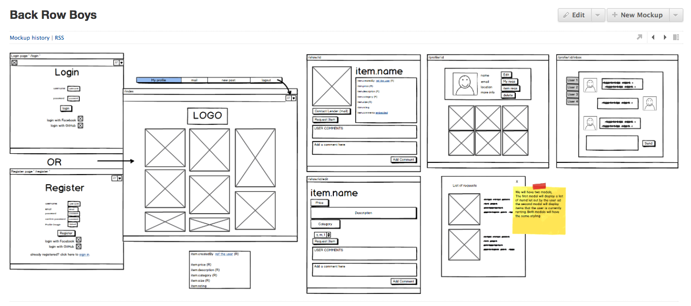

#GA WDI London - Project 3

Sam, Buki, Jake and Hannah

Project link - https://guarded-refuge-81006.herokuapp.com/

####Approach / How It Works

- The idea behind the app was to create a place where users could post items of clothing for other users to rent.  A user can them come along and 'request' the item and let the item owner know the number of days they want the item for and can also comment on the item as well.  At this point, both the user and the item owner receive different emails confirming the request.  The item owner then needs to go to the Fabric website to 'accept' the request.  The user then is able to pay for the item using Stripe and another set of emails is sent to both parties once the payment has been made.  

- Users can login using either an email address, Facebook, Instagram or Github.  Users are able to upload images and descriptions of their item that they want to rent and then edit and delete these posts .  They're also able to update or delete their profile.

####The Build

- As a team, we started wire framing on the white board and moved those ideas to Balsamiq.

- We began the app by building out the restful routes and pages, then linked it to our database.  We split the group and pair-coded the front and the back ends separatly.

- Once the pages and links worked together, we added the image uploader using AWS to the 'new item' page.  

- We then added authentication so users would need to be logged into use the app.  

- Comments feature was added, and conditions so that only the owner of the comment could delete that comment.  

- We added Facebook, GitHub and Instagram logins using their documentation.

- I also added authentication features meaning that (inc getting blogs to edit or not depending on whether it’s your app)

- Secure Route. Conditions were also added to the items pages so that blogs could only be edited or deleted by the owners of that blog.

###Testing

#### Problems & Challenges

- working in a team
- Github conflicts
- Oauth - instagram
- websockets - had to be removed :(
- Circle on the map/set radius - ONE LINE!!!!
- filters - both catagory and price
- images upload

#### Blockers and Unsolved Problems

- we shall see in the presentation
- questionable items uploaded by the public
- sometimes the comment for the item pops up in the top corner when you make the request

###What went well

- Splitting up all the controllers, made de-bugging much easier
- Trello
- Commiting to GitHub in the same room

#### Future Changes and Additional features

- websocket
- cleaner styling
- SASS in partials
- Routes (logging in and out sometimes renders index page or login page)
- postage API?
- Front-end testing

####Resources
